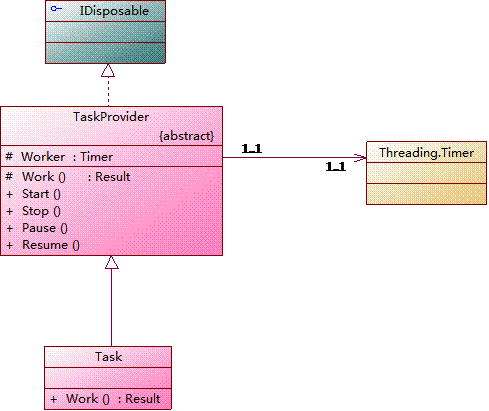

# SwarmTask [WindowsService TaskScheduler]

#### 欢迎使用**蜂群**任务框架，注意：此框架针对开发人员。
#### Welcome to SwarmTask, this framework is only prepare for devloper.
 - 作用：任务调度框架，类似于Quartz.Net。按接口实现实现任务，在配置里设定调用参数；
 - 原项目地址：[https://wstask.codeplex.com/](https://wstask.codeplex.com/)  ，2015-09-25 项目更名为SwarmTask（中文代号：蜂群）；
 - 以高性能，高效率为升级设计目标，升级项目为VS2015 IDE环境 , .Net版本4.5

### Build & Test Status ###
----------

----------

### 一、功能摘要：

 - 启动触发时间采用开源的Quartz.Net项目的Cron表达式："0 0 12 * * ?" 每天中午12(UTC时间)点触发；
 - 多线程运行各任务，互不干扰；
 - 自动监视配置文件，配置文件更改后服务自动重启（新的配置将取代旧的配置信息，原先的任务将会被标记为移除，任务全部重新加入）；
 - 配置Tasks.config中可以引用公用的资源；
 - 具体任务中可以引用公有资源，并加入本任务对应的相关参数；
 - 具体任务配置中加上Settings设置，方便加入一些配置信息，如果还是不能满足，那么就要自定义Extend的扩展了。

### 二、运行机制：

 - 每个任务做为一个独立的运行线程 隐喻：工人；
 - 服务本身做为一个独立线程 隐喻：监督工人；
 - 监督工人每隔 N 秒轮询一次任务，如发现任务的触发时间小于间隔N*3 即创建该任务并且启动该任务（后续的运行控制由该任务控制）；
 - 启动后的任务根据启动时间于特定时间执行任务；
 - 工人工作完本身任务后自动停止（如何下次间隔执行时间大于N*7也会被移除）。待下一轮监督工人查看时清除任务对象；
 - 配置文件错误时将自动跳过，如果enable为false该任务将直接不初始化

### 三、任务驱动UML图

### 四、项目内容：

 - CS.SwarmTask 运行宿主
 - CS.SwarmTask.Framwork 任务调度框架
 - CS.SwarmTask.Tests 一些测试，这个随便写的
 - CSHive[v3.0]  **CSHive** 是一个通用常用库，项目地址：https://github.com/CSStudio/CSHive

### 五、任务实现代码：

 - 参见CS.TaskScheduling.TaskDemo, CS.SwarmTask.Framwork的示例实现；
 - 继承TaskProvider类后，重写protected override Result Work() 即可；
 - 如果自已扩展了Extend节点，则要重写public override void InitExtend()方法；
 - 具体备置可参见Tasks.config文件
 - 注意：不要在构造方法中读取配置文件信息

### 六、WindService的调试：

 - 测试：在控制台中执行 `CS.SwarmTask -t`
 - 安装：在控制台中执行 `CS.SwarmTask -i`
 - 卸载：在控制台中执行 `CS.SwarmTask -u`

### 七、更新列表：

---- 2016-06 --------------------------
- 修改TaskProvider的运行将实现类的异常进行包装，修正因为实现类异常导致的服务挂起
- 修正错误时默认的休眠时间为5分钟而不是原来的1天多   ->0.2.7

----udpate:2016-05-26---Verion:0.2.6-----
- DDNS：加入DNSPod的实例，批量将所有泛解析更新为新的IP地址。（[原DNSPodAPI源码地址](http://git.oschina.net/zhengwei804/DNSPodForNET)） -> 0.2.6.0

----udpate:2015-10-27---Verion:0.2.0-----

 - 全部重构，状态不保存，待后续开发时确定，版本退化至0.2.0
 - 项目更名为SwarmTask（中文代号：蜂群）；
 - 引入CSHive常用库，去除CS.Commom库；
 - 如果配置中出错，那么该项任务将会被自动跳过。原先是中止程序运行。

----udpate:2010-07-07---To:1.3.1 Beta2-----
 -  配置初始化功能；
 - 明确补全功能，注意：补全功能是按执行结果的XML文件里的最后成功执行时间来计算下一个周期点的。修改补全时间时必须停止服务(肯定是手动大改动)；
 - Tasks.config配置中增加公用资源部分配置，这样就可以共用一些通用的资源信息了；
 - 增加所有总服务状态Task4WinService.Status，这个好像还是有问题；
 - 增加了一个默认的扩展配置保护属性Extend, 如果自定义了扩展配置后可以重写LoadExtendConfig方法 Extend.Settings"key".Value ；

----udpate:2010-07-26---To:1.3.2 Beta1-----
 - 调整文件及程序集信息；
 - 重写预定义好的预定义扩展，预定义扩展是引用公有资源再加上可能的参数组成；
 -  * 注意，具体任务中不要抛出异常，以免使整个服务挂起；
 - DataTableToDataTable表对表导入任务实现；
 - Tasks.config中的预扩展中Params参数加入 对<!CDATA[]> 支持，以避免手动转义特殊字符，注：text中有值时会覆盖value中的值。

---update:2014-12-01--TO:Ver:1.5 Beta1----
 - 安装方式直接集成至控制台；
 - 配置信息直接由配置文件中配置；

----------

### 关于作者 ###

[艺风在线](http://max.cszi.com)
----------
##### 我要站在巨人们的肩膀上才行呀 #####

